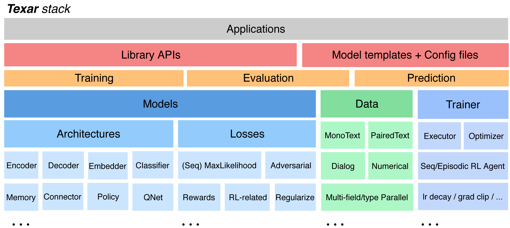

<div align="center">
   <br><br>
</div>
 
-----------------


[](https://pypi.python.org/pypi/texar)
[](https://travis-ci.org/asyml/texar)
[](https://codecov.io/gh/asyml/texar)
[](https://texar.readthedocs.io/en/latest/?badge=latest)
[](https://github.com/asyml/texar/blob/master/LICENSE)
 

**Texar** is a toolkit aiming to support a broad set of machine learning, especially natural language processing and text generation tasks. Texar provides a library of easy-to-use ML modules and functionalities for composing whatever models and algorithms. The tool is designed for both researchers and practitioners for fast prototyping and experimentation.


### Key Features
* **Two Versions, (Mostly) Same Interfaces**. Texar-TensorFlow (this repo) and **[Texar-PyTorch](https://github.com/asyml/texar-pytorch)** have mostly the same interfaces. Both further combine the best design of TF and PyTorch:
  - Interfaces and variable sharing in *PyTorch convention*
  - Excellent factorization and rich functionalities in *TF convention*.
* **Rich Pre-trained Models, Rich Usage with Uniform Interfaces**. BERT, GPT2, XLNet, etc, for encoding, classification, generation, and composing complex models with other Texar components!
* **Fully Customizable** at multiple abstraction level -- both novice-friendly and expert-friendly. 
  - Free to plug in whatever external modules, since Texar is fully compatible with the native TF/PyTorch APIs. 
* **Versatile** to support broad tasks, models, algorithms, data processing, evaluation, etc. 
   - encoder(s) to decoder(s), sequential- and self-attentions, memory, hierarchical models, classifiers... 
   - maximum likelihood learning, reinforcement learning, adversarial learning, probabilistic modeling, ... 
* **Modularized** for maximal re-use and clean APIs, based on principled decomposition of *Learning-Inference-Model Architecture*. 
* **Distributed** model training with multiple GPUs.
* Clean, detailed [documentation](https://texar.readthedocs.io) and rich [examples](./examples).


<div align="center">
   <br><br>
</div> 

### Library API Example
Builds an encoder-decoder model, with maximum likelihood learning:
```python
import texar.tf as tx

# Data 
data = tx.data.PairedTextData(hparams=hparams_data) # a dict of hyperparameters 
iterator = tx.data.DataIterator(data)
batch = iterator.get_next()                         # get a data mini-batch

# Model architecture
embedder = tx.modules.WordEmbedder(data.target_vocab.size, hparams=hparams_emb)
encoder = tx.modules.TransformerEncoder(hparams=hparams_enc)
outputs_enc = encoder(inputs=embedder(batch['source_text_ids']),  # call as a function
                      sequence_length=batch['source_length'])
                      
decoder = tx.modules.TransformerDecoder(
    output_layer=tf.transpose(embedder.embedding) # tie input embedding w/ output layer
    hparams=hparams_decoder)
outputs, _, _ = decoder(memory=output_enc, 
                        memory_sequence_length=batch['source_length'],
                        inputs=embedder(batch['target_text_ids']),
                        sequence_length=batch['target_length']-1,
                        decoding_strategy='greedy_train')    # teacher-forcing decoding
                        
# Loss for maximum likelihood learning
loss = tx.losses.sequence_sparse_softmax_cross_entropy(
    labels=batch['target_text_ids'][:, 1:],
    logits=outputs.logits,
    sequence_length=batch['target_length']-1)  # automatic sequence masks

# Beam search decoding
outputs_bs, _, _ = tx.modules.beam_search_decode(
    decoder,
    embedding=embedder,
    start_tokens=[data.target_vocab.bos_token_id]*num_samples,
    end_token=data.target_vocab.eos_token_id)
```
The same model, but with adversarial learning:
```python
helper = tx.modules.GumbelSoftmaxTraingHelper( # Gumbel-softmax decoding
    start_tokens=[BOS]*batch_size, end_token=EOS, embedding=embedder)
outputs, _ = decoder(helper=helper)            # automatic re-use of the decoder variables

discriminator = tx.modules.BertClassifier(hparams=hparams_bert)        # pre-trained model

G_loss, D_loss = tx.losses.binary_adversarial_losses(
    real_data=data['target_text_ids'][:, 1:],
    fake_data=outputs.sample_id,
    discriminator_fn=discriminator)
```
The same model, but with RL policy gradient learning:
```python
agent = tx.agents.SeqPGAgent(samples=outputs.sample_id,
                             logits=outputs.logits,
                             sequence_length=batch['target_length']-1,
                             hparams=config_model.agent)
```
Many more examples are available [here](./examples)
  
### Installation

**(Note: Texar>0.2.3 requires Python 3.6 or 3.7. To use with older Python versions, please use Texar<=0.2.3)**

Texar requires:

* `tensorflow >= 1.10.0 (but < 2.0.0)`. Follow the [tensorflow official instructions](https://www.tensorflow.org/install) to install the appropriate version
* `tensorflow_probability >= 0.3.0 (but < 0.8.0)`. Follow the [tensorflow_probability official instractions](https://www.tensorflow.org/probability/install) to install.

After `tensorflow` and `tensorflow_probability` are installed, install Texar from PyPI: 
```bash
pip install texar
```

To use cutting-edge features or develop locally, install from source: 
```
git clone https://github.com/asyml/texar.git
cd texar
pip install .
```

### Getting Started
* [Examples](./examples)
* [Documentation](https://texar.readthedocs.io)

### Reference
If you use Texar, please cite the [tech report](https://arxiv.org/abs/1809.00794) with the following BibTex entry:
```
Texar: A Modularized, Versatile, and Extensible Toolkit for Text Generation
Zhiting Hu, Haoran Shi, Bowen Tan, Wentao Wang, Zichao Yang, Tiancheng Zhao, Junxian He, Lianhui Qin, Di Wang, Xuezhe Ma, Zhengzhong Liu, Xiaodan Liang, Wanrong Zhu, Devendra Sachan and Eric Xing
ACL 2019

@inproceedings{hu2019texar,
  title={Texar: A Modularized, Versatile, and Extensible Toolkit for Text Generation},
  author={Hu, Zhiting and Shi, Haoran and Tan, Bowen and Wang, Wentao and Yang, Zichao and Zhao, Tiancheng and He, Junxian and Qin, Lianhui and Wang, Di and others},
  booktitle={ACL 2019, System Demonstrations},
  year={2019}
}
```

### License
[Apache License 2.0](./LICENSE)
